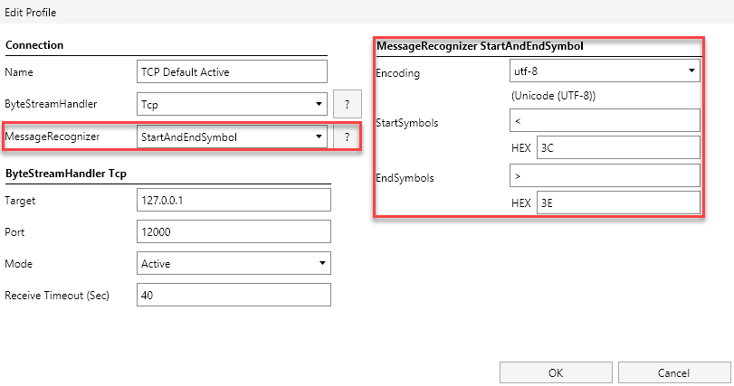

# MessageRecognizer
The MessageRecognizer is responsible to wrap outgoing messages with the right information like common header or end-symbols.
In sending mode, it wraps messages with additional information and forwards all data to the ByteStreamHandler. In 
receiving mode, it gets data from the ByteStreamHandler and removes these information again.

Example: MessageRecognizer EndSymbols with ## as endsymbol
 - Sending 'TestMessage' will be modified to 'TestMessage##' before forwarded to ByteStreamHandler.
 - Receiving 'TestMessage##' will be modiefied to 'TestMessage' before forwarded to application.

Configuration within a profile is structured as shown in the following screenshot.

## MessageRecognizers
### Default
A custom format defined by MessageCommunication application. It encapsulates messages within
`<` and `>` symbols and puts also the length of the message in the header. The header is closed by `|`.
This MessageRecognizer supports full character range in the message and flexible length.

Examples:
 - `<10|abcdefghif>` for message `abcdefghif`
- `<22|This is a test message>` for message `This is a test message`
 - `<3|abc>` for message `abc`

Parameters:
 - *Encoding*: Character encoding for communication.

### EndSymbol
A message is defined to have specific symbols at the end. The end sign itself
must not be contained in the message. The length of messages is flexible.

Examples (end symbols are `##`):
 - `This is a test message##` for message `This is a test message`
 - `abc##` for message `abc`

Parameters:
 - *Encoding*: Character encoding for communication.
 - *EndSymbols*: One or more characters which mark the end of a message.

### FixedLengthAndEndSymbol
A message is defined to have a fixed length and specific symbols at the end. The provided end symbols can appear inside
the message but we have a maximum length for messages.

Examples (end sign is ##, length is 30 and fill symbol is .):
- `This is a test message......##` for message `This is a test message`
- `abc.........................##` for message `abc`

Parameters:
 - *Encoding*: Character encoding for communication.
 - *EndSymbols*: One or more characters which mark the end of a message.
 - *Length Including EndSymbols*: Fixed length of the message.
 - *Fill Symbol*: The symbol with which to fill unused space in the message.

## StartAndEndSymbol
A message is defined to start with one or more start symbols and ends with one or mor end symbols. A message can contain
start symbols but must not contain the end symbols. The length of messages is flexible. 

Examples (start symbol is `<`, end symbol is `>`):
- `<This is a test message>` for message `This is a test message`
- `<abc>` for message `abc`

Parameters:
 - *Encoding*: Character encoding for communication.
 - *StartSymbols*: One or more characters which mark the start of a message.
 - *EndSymbols*: One or more characters which mark the end of a message.

## FixedLength
A message is defined by a fixed length. Messages do support full character range but have a maximum length.

Examples (length is 30 and fill symbol is .):
- `This is a test message........` for message `This is a test message`
- `abc...........................` for message `abc`

Parameters:
- *Encoding*: Character encoding for communication.
- *Length Including EndSymbols*: Fixed length of the message.
- *Fill Symbol*: The symbol with which to fill unused space in the message.

## ByUnderlyingPackage
There is no real definition of a message. Each message is sent as is by the ByteStreamHandler. Also each package 
received on the ByteStreamHandler is recognized as a full message.

Examples:
- `This is a test message` for message `This is a test message`
- `abc` for message `abc`

Parameters
 - *Encoding*: Character encoding for communication.