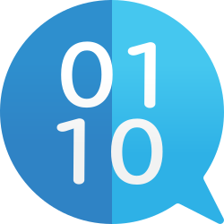
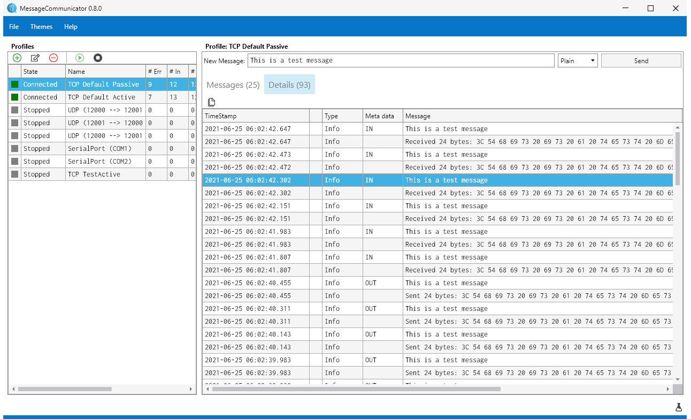
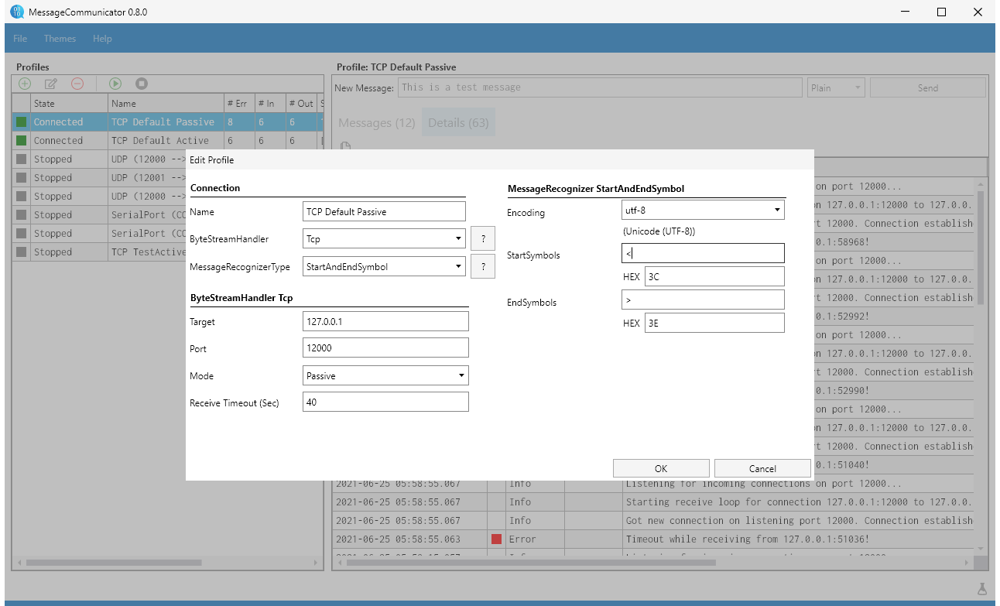

# MessageCommunicator 

## About
MessageCommunicator is a .NET library + testing Gui for message-based communication. 
The library can be integrated into apps supporting .NET Standard 2.0 or .NET 8.0. It 
is distributed using Nuget. The Gui is build using C# and Avalonia, 
therefore it supports the desktop environments on Windows, Linux and Mac.

## Quick Links
 - [Current progress / roadmap](/../../projects/1)
 - [Releases](/../../releases)
 - [Nuget](https://www.nuget.org/packages/MessageCommunicator)

## Build
 - /badge.svg)
 - /badge.svg)

### Features
The library provides the following features:
 - Automated reconnect handling (you don't have to care about the connection)
 - Message recognition (e. g. by end symbol, by fixed length, etc.)
 - String encoding
 - Different channel types (TCP, UDP, SerialPort)

### Library
The library is designed to be cross-platform, asynchronous and to use as less object allocations as possible.
In the following example we are creating a channel which listens for incoming tcp connections on
port 12000. Messages are encoded by UTF8 and use ## as end sign.

```csharp
// Create and start passive channel (listens for incoming tcp connection)
var passiveTcpChannel = new MessageChannel(
    new TcpPassiveByteStreamHandlerSettings(IPAddress.Loopback, 12000),
    new EndSymbolsMessageRecognizerSettings(Encoding.UTF8, "##"),
    (message) =>
    {
        Console.WriteLine($"Received message on passive channel: {message}");
    });
await passiveTcpChannel.StartAsync();
```

In the following example we are doing almost the same. The only difference is that we do not 
listen. Here we are connecting to port 12000 on the localhost.

```csharp
// Create and start send channel
var activeTcpChannel = new MessageChannel(
    new TcpActiveByteStreamHandlerSettings(IPAddress.Loopback, 12000), 
    new EndSymbolsMessageRecognizerSettings(Encoding.UTF8, "##"),
    (message) =>
    {
        Console.WriteLine($"Received message on active channel: {message}");
    });
await activeTcpChannel.StartAsync();
```

Sending a message is as easy as:
```csharp
await activeTcpChannel.SendAsync("Message 1 from active to passive...");
```

### Gui
Inside the testing Gui you can manage multiple profiles. Each profile has its own configuration
for which stream it uses (tcp active, tcp passive. ...) and which message recognizer it uses
(endsymbols, etc.). The Gui also displays all logging messages which come through the logger of 
the corresponding message channel.





## Project is based on...
MessageCommunicator GUI is based on .NET 7 and meant to be cross-platform. The Library supports .NET Standard 2.0, .NET 6.0 and .NET 7.0.

The project is based on following technologies / projects:
 - [Avalonia](https://github.com/AvaloniaUI/Avalonia): Cross-platform, Xaml based UI framework
 - [Avalonia.IconPacks](https://github.com/ahopper/Avalonia.IconPacks): A good collection of free vector icons ready to be used in Avalonia applications
 - [Inconsolata](https://fonts.google.com/specimen/Inconsolata): Inconsolata is an open-source font created by Raph Levien and released under the SIL Open Font License.
 - [Light.GuardClauses](https://github.com/feO2x/Light.GuardClauses): A lightweight .NET library for expressive Guard Clauses
 - [Markdown.Avalonia](https://github.com/whistyun/Markdown.Avalonia): Markdown.Avalonia is a portted version of [MdXaml](https://github.com/whistyun/MdXaml) for Avalonia UI. It can render Markdown with avalonia.
 - [ReactiveUI](https://github.com/reactiveui/ReactiveUI): Cross-platform mvvm framework. Avalonia has additional integration for ReactiveUI
 - [StringFormatter](https://github.com/MikePopoloski/StringFormatter): A copy/paste ready alternative to StringBuilder. StringFormatter is optimized for less object allocations
 - [Svg.Skia](https://github.com/wieslawsoltes/Svg.Skia): SVG rendering library with good Avalonia integration.
