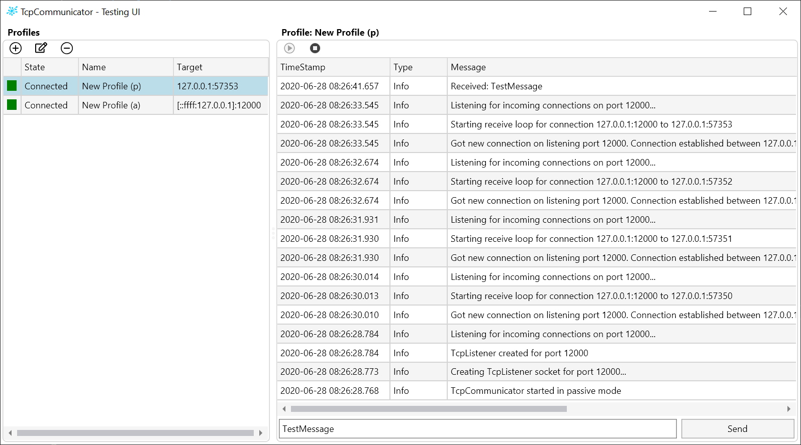

# MessageCommunicator
### About
tbd.

I use the following technologies / projects:
 - [Avalonia](https://github.com/AvaloniaUI/Avalonia): Crossplatform, Xaml based UI framework
 - [Avalonia.IconPacks](https://github.com/ahopper/Avalonia.IconPacks): A good collection of free vector icons ready to be used in Avalonia applications
 - [ReactiveUI](https://github.com/reactiveui/ReactiveUI): Crossplatform mvvm framework. Avalonia has additional integration for ReactiveUI
 - [StringFormatter](https://github.com/MikePopoloski/StringFormatter): A copy/paste ready alternative to StringBuilder. StringFormatter is optimized for less object allocations

### Screenshot
