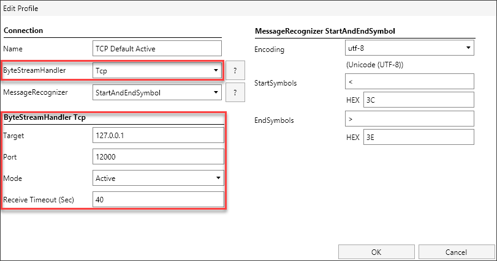

# ByteStreamHandler
The ByteStreamHandler is responsible for sending and receiving
binary packages. For sending, it gets all bytes to be sent from the
MessageRecognizer. For receiving, it forwards all received bytes
to the MessageRecognizer.

Configuration within a profile is structured as shown in the following screenshot.

The parameters have the following meaning:
- ByteStreamHandler **Tcp**
    - *Target*: IP or hostname of the target host. This parameter is not relevant in passive mode.
    - *Port*: The port to listen or to connect to (depending on the mode).
    - *Mode*:
        - Active: Connect to a remote host and port in active mode.
        - Passive: Listen on a local port for incoming connections (Target parameter not relevant).
    - *Receive Timeout (Sec)*: When no packages are received during the given timespan, than a reconnect will be
      triggered.

- ByteStreamHandler **Udp**:
    - *LocalPort*: The port on which to listen for incoming packages.
    - *RemoteHost*: The remote host (hostname or ip address) to which to send outgoing packages.
    - *RemotePort*: The remote port to which to send outgoing packages.

    
- ByteStreamHandler **SerialPort**:
    - *Port*: The COM port through which to communicate.
    - *Baud Rate*: The serial baud rate.
    - *Data Bits*: The standard length of data bits per byte.
    - *Stop Bits*: The standard number of stop bits per byte.
    - *Handshake*: The handshaking protocol for communication.
    - *Read Timeout*: The number of milliseconds before a timeout occurs when a read operation does not finish.
    - *Write Timeout*: The number of milliseconds before a timeout occurs when a write operation does not finish.
    - *Parity*: The parity-checking protocol.
    - *Dtr Enabled*: Is Data Terminal Ready (DTR) signal enabled?
    - *Rts Enabled*: Is Request to Send (RTS) signal enabled?